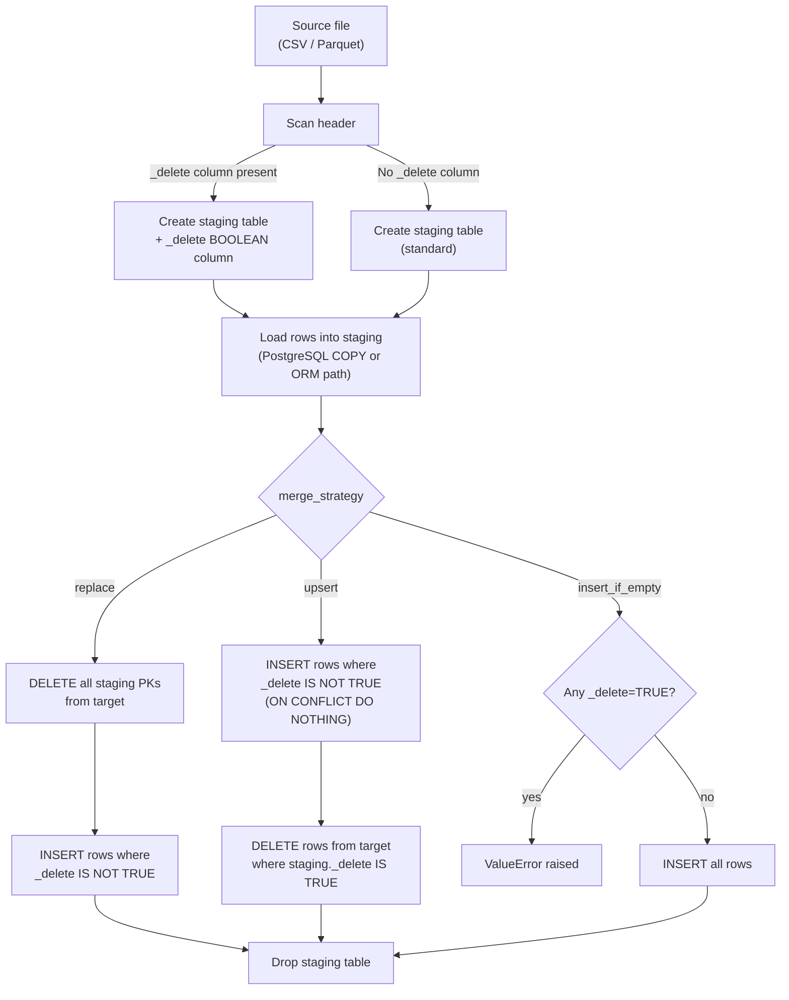
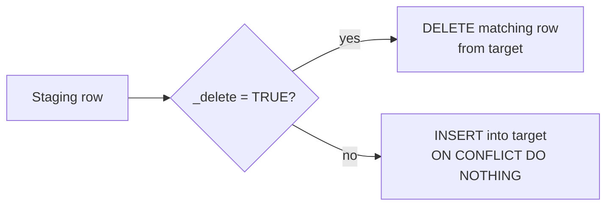

# Incremental Loads and Explicit Row Deletes

Most ingestion pipelines need to handle two things in the same extract file: records that should land in the target, and records that should be removed from it. The `_delete` column convention is how orm-loader supports this without a separate delete API, a full table reload, or any extra pipeline configuration.

The pattern works at both ends of the pipeline:

- **Source teams** add a `_delete` column to their extract files and mark rows for removal.  
- **Pipeline engineers** call `load_csv` exactly as they would for a standard load; the delete path is automatic.

---

## The `_delete` column

### Preparing source files

Add a column named **`_delete`** to your extract file. orm-loader accepts a range of common representations for true and false:

| Value (case-insensitive) | Treated as |
|---|---|
| `true`, `1`, `t`, `yes` | delete this row |
| `false`, `0`, `f`, `no` | normal insert/upsert row |
| empty, null | normal insert/upsert row |
| anything else | `ValueError` — load is rejected |

The column can appear anywhere in the file; column order does not matter. Rows without a value in `_delete` are treated identically to rows with `false`.

**Delete markers only need a primary key.** Non-PK columns on delete-marked rows can be empty — orm-loader preserves these rows through the normalisation step precisely because only the primary key is needed to drive the DELETE. Your source system should not need to fabricate placeholder values.

```
patient_id,dob,sex,postcode,_delete
P001,1982-04-11,F,2000,false       ← amended record
P002,1975-09-23,M,3000,            ← no _delete value, treated as insert
P099,,,,true                       ← delete marker: only PK is needed
```

### Detection is automatic

orm-loader scans the file header before reading any data rows. If `_delete` is present, a `_delete BOOLEAN` column is added to the staging table and the merge step applies delete-aware logic. If `_delete` is absent, nothing changes. No flag on `load_csv` is required.

!!! warning
    Any value outside the accepted set raises `ValueError` and rejects the load immediately. If your source system produces unexpected flag formats (for example `Y`/`N`, or integer codes other than `0`/`1`), normalise them before delivery.

---

## How the pipeline handles `_delete` files



The PostgreSQL COPY fast-path is not bypassed. The staging table gains a `_delete BOOLEAN` column and the COPY command includes it — throughput is unaffected.

---

## Choosing a merge strategy

The right strategy depends on what your source system is expressing in the extract, not on how orm-loader works internally.

| Strategy | Delete-marked rows | Non-delete rows | Rows already in target, not in this extract |
|---|---|---|---|
| `replace` | Not re-inserted (removed in the DELETE phase along with all other staging PKs) | Inserted after the DELETE phase | Removed — the DELETE phase covers all PKs in the staging file |
| `upsert` | Removed from target via DELETE phase | Inserted, or left unchanged if PK already exists | **Preserved** — upsert only touches PKs present in staging |
| `insert_if_empty` | `ValueError` raised | Inserted (target must be empty) | — |

**Use `replace`** when your source system owns the full picture of the cohort being delivered. Every record in the file — whether marked for deletion or not — is within scope. Records in the target that also appear in the file get replaced; delete-marked ones are not re-inserted. Records that have gone from the file entirely are removed in a subsequent extract's DELETE phase or via a full reload.

**Use `upsert`** when the source system delivers genuinely partial deltas. Only the records that changed appear in the file. Existing records not mentioned in the extract survive untouched. Cancellations and retirements arrive as `_delete=true` rows.



---

## Worked examples

### Patient registry — nightly demographic corrections (`replace`)

A hospital's PAS system exports a nightly delta for the patient demographics table. The extract covers every patient whose record was touched that day: corrected demographics, newly registered patients, and patients whose records need to be retired (test accounts, resolved duplicates). Because the source system provides complete ownership of every record it touches, `replace` is the right strategy.

**Source file: `patient.csv`**

```
patient_id,dob,sex,postcode,_delete
P001,1982-04-11,F,2000,false
P002,1975-09-23,M,3000,false
P099,,,,true
P100,1990-01-15,F,4000,false
P201,,,,true
```

`P099` and `P201` carry only their patient IDs — the loader preserves these through the normalisation step without requiring fabricated values in the other columns.

**Pipeline:**

```python
import sqlalchemy as sa
import sqlalchemy.orm as so
from orm_loader.tables import CSVLoadableTableInterface

class Base(so.DeclarativeBase):
    pass

class Patient(Base, CSVLoadableTableInterface):
    __tablename__ = "patient"

    patient_id: so.Mapped[str] = so.mapped_column(sa.String(20), primary_key=True)
    dob:        so.Mapped[str] = so.mapped_column(sa.Date,       nullable=True)
    sex:        so.Mapped[str] = so.mapped_column(sa.String(1),  nullable=True)
    postcode:   so.Mapped[str] = so.mapped_column(sa.String(10), nullable=True)
```

```python
with Session(engine) as session:
    Patient.load_csv(session, "patient.csv", merge_strategy="replace")
    session.commit()
```

**What happens to the target:**

| patient_id | Before load | After load |
|---|---|---|
| P001 | `dob=1981-04-11` (typo) | `dob=1982-04-11` (corrected) |
| P002 | `dob=1975-09-23` | unchanged — replace re-inserts from staging |
| P099 | exists (test account) | **deleted** |
| P100 | does not exist | inserted |
| P201 | exists (resolved duplicate) | **deleted** |

`replace` deletes all five PKs from the target first, then inserts the three non-delete rows. `P099` and `P201` are removed and not re-inserted.

---

### ED encounters — event stream with cancellations (`upsert`)

An emergency department system publishes a daily event stream for the encounter table. This is a genuine partial delta: the file contains only the encounters that were created or cancelled since the last extract. Encounters finalised in earlier loads must not be affected. `upsert` is the right strategy because it leaves records outside the current delta untouched.

**Source file: `encounter.csv`**

```
encounter_id,patient_id,encounter_date,status,_delete
E1001,P001,2026-05-27,admitted,false
E1002,P002,2026-05-27,discharged,false
E0850,P099,2026-05-20,,true
E1003,P100,2026-05-28,admitted,false
```

`E0850` is a cancellation. Only the encounter ID is needed; the other columns are left empty.

**Pipeline:**

```python
class Encounter(Base, CSVLoadableTableInterface):
    __tablename__ = "encounter"

    encounter_id:   so.Mapped[str] = so.mapped_column(sa.String(20), primary_key=True)
    patient_id:     so.Mapped[str] = so.mapped_column(sa.String(20), nullable=True)
    encounter_date: so.Mapped[str] = so.mapped_column(sa.Date,       nullable=True)
    status:         so.Mapped[str] = so.mapped_column(sa.String(20), nullable=True)
```

```python
with Session(engine) as session:
    Encounter.load_csv(session, "encounter.csv", merge_strategy="upsert")
    session.commit()
```

**What happens to the target:**

| encounter_id | Before load | After load |
|---|---|---|
| E0750 | exists (earlier extract) | **preserved** — not in today's delta |
| E0850 | exists (admitted earlier) | **deleted** |
| E1001 | does not exist | inserted |
| E1002 | does not exist | inserted |
| E1003 | does not exist | inserted |

`E0750` is not in the file and survives. That is the critical property of `upsert` — only rows whose PKs appear in the current staging file are affected.

---

### Reference and vocabulary data — no `_delete` needed

Reference tables distributed as complete snapshots (OMOP vocabulary files, lookup lists) do not need a `_delete` column. A `replace` load without `_delete` is equivalent to a full truncate-and-reload — all staging PKs are removed from the target and replaced with the current snapshot. Because the source file has no `_delete` column, the convention is never activated and there is no delete-phase behaviour to reason about.

```python
# CONCEPT.csv has no _delete column — standard replace
with Session(engine) as session:
    Concept.load_csv(session, "CONCEPT.csv", merge_strategy="replace")
    session.commit()
```

---

## Pipeline configuration

### Idempotency and retry

Both `replace` and `upsert` are safe to retry. Running the same load twice produces the same target state.

With `replace`, the DELETE phase removes all staging PKs on each run, so re-running after a partial failure does not leave the target in an inconsistent state. With `upsert`, `ON CONFLICT DO NOTHING` makes the INSERT phase idempotent, and deleting an already-absent row is a no-op.

```python
for attempt in range(1, 4):
    try:
        with Session(engine) as session:
            Patient.load_csv(session, "patient.csv", merge_strategy="replace")
            session.commit()
        break
    except OperationalError:
        if attempt == 3:
            raise
        logger.warning("Load attempt %d failed, retrying", attempt)
```

!!! note
    Idempotency holds only if the source file is the same across retries. If your delivery layer may substitute files mid-retry, ensure atomicity at that layer.

### Batched merges

Large loads can keep transaction size under control with `merge_batch_size`. Both the DELETE and INSERT phases paginate using this value.

```python
Patient.load_csv(
    session,
    "patient.csv",
    merge_strategy="replace",
    merge_batch_size=250_000,   # default is 1_000_000
)
```

Lowering the batch size reduces peak lock duration at the cost of more round-trips and commits.

### First load onto an empty target

When the target table is empty and `merge_strategy="replace"`, the load is routed through an insert-only fast path. Any delete-marked rows in the file produce a log warning and are skipped — there is nothing to delete in an empty table.

When `merge_strategy="upsert"` and `_delete` is present, the fast path is suppressed so the DELETE phase runs (as a no-op on an empty table), preserving consistent behaviour across repeated loads.

### Bypassing the convention

If your ORM model has a column literally named `_delete` — a soft-delete flag stored in the target table, for example — pass `honour_delete_marker=False`:

```python
Patient.load_csv(session, "patient.csv", honour_delete_marker=False)
```

The `_delete` column is then treated as an ordinary data column and loaded into the target as-is. No DELETE phase is applied.

If you leave `honour_delete_marker=True` (the default) and the model has a column named `_delete`, the load is rejected before any data moves:

```
ValueError: Table 'patient': the model declares a column named '_delete',
which conflicts with the reserved CDC delete-marker column. Rename the model
column or pass honour_delete_marker=False to bypass this check.
```

---

## Schema tooling

[schemancer](https://github.com/AustralianCancerDataNetwork/schemancer) is an early-stage tool that scans a folder of source CSV, TSV, or Parquet files, infers a schema registry, and generates SQLAlchemy model scaffolding. If the source files already include a `_delete` column, adding `CSVLoadableTableInterface` to the generated models is all that is needed to enable incremental loads — no further configuration is required.

!!! warning
    schemancer is in alpha. Treat generated models as a starting point and review them before use in production pipelines.
